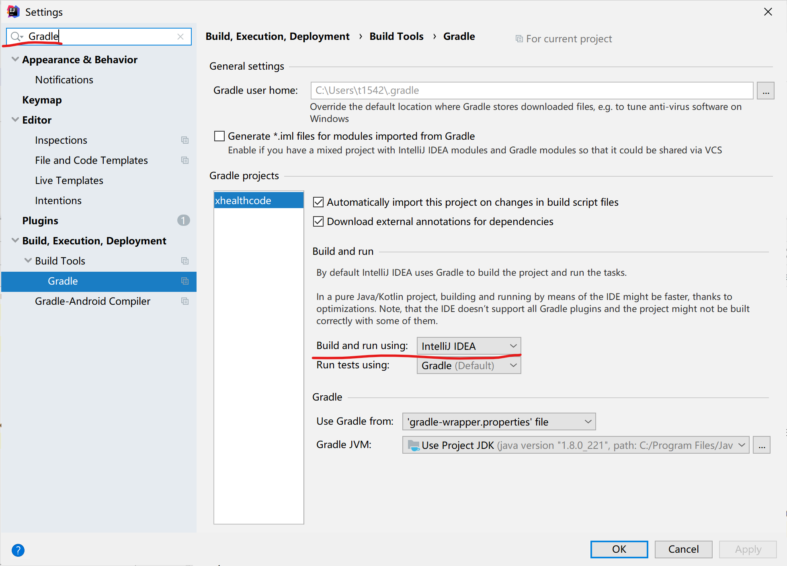
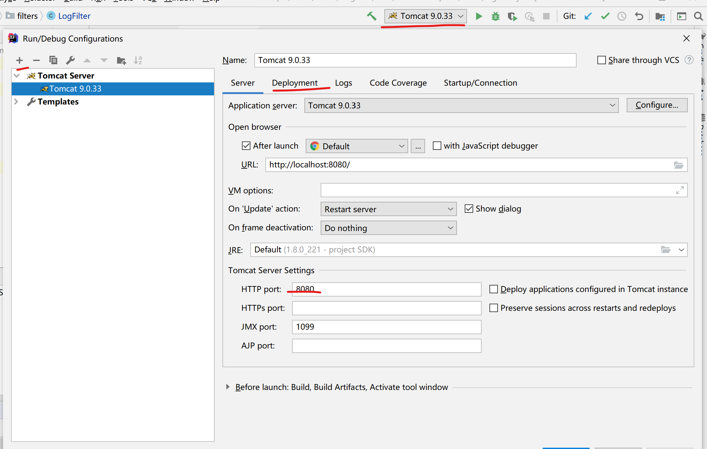

# Web应用开发系列文档

## 目录

[首页](./README.md)
[页面设计](./doc/pages.md)
[模型设计](./doc/models.md)
[请求模型](./doc/requestmodel.md)
[仓储](./doc/repository.md)
[插件](./doc/addin.md)
[Sql代码](./doc/sqls.md)

## 准备开发

### 第一步：克隆仓库

### 第二步：打开Intellj IDEA，进行项目配置

*此项目使用Gradle作为软件的依赖包管理工具*

打开File > Settings，搜索Gradle。

将其中的Build and run using的设置改成IntellJ IDEA

### 第三步：进行启动项配置

打开启动项设置（启动左边的按钮）(Edit Configurations...)，然后点击左上角的+按钮，然后选择Tomcat Server>Local。然后按照下面的图进行设置。

在Server中，可以修改Http port。

在Deployment中，可以修改Application Context，可以修改为/

### 第四步：将Web-INF下的web.xml.example文件重命名为web.xml，并进行相关的修改，使其符合当前的环境。

## 项目介绍

Web应用设计开发大作业，使用Java Servlet进行开发。

已经实现了部分工具类的代码，详情请见[插件](./doc/addin.md)也进行查看。主要有快速绑定模型到数据库，快速验证，过滤器Filter等代码。

